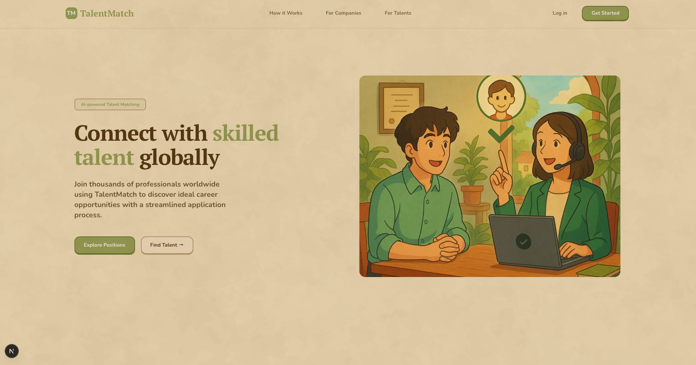
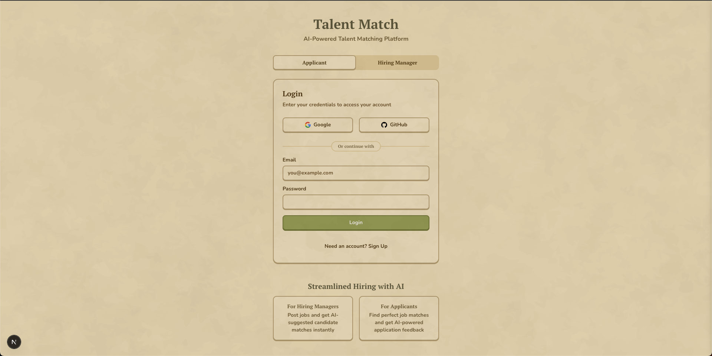

# Talent Match MVP

An AI-powered talent matching platform that efficiently connects hiring managers with suitable candidates.


(landing page)


(auth page)

## Features

- **For Hiring Managers:** Post jobs and get AI-suggested candidate matches
- **For Candidates:** View job postings, apply, and receive AI-driven feedback
- **AI Integration:** Uses Cohere API for intelligent matching

## Tech Stack

- **Frontend:** Next.js 14, Tailwind CSS, Shadcn UI Components
- **Backend:** Supabase (Authentication, Database, Storage)
- **AI:** Cohere API

## Resume Analysis Features

The platform supports uploading and AI analysis of resumes in PDF and DOCX formats:

- PDF processing uses Unstructured.io for accurate text extraction that preserves layout and formatting
- DOCX processing uses Mammoth.js for reliable text extraction
- AI analysis powered by Cohere's Command-R-Plus model
- Analysis includes skill extraction, experience identification, education details, strengths and improvement areas
- Each resume receives an overall score on a scale of 0-10

## Getting Started

### Prerequisites

- Node.js (18.x or newer)
- Yarn package manager
- Supabase account

### Installation

1. Clone the repository
   ```
   git clone <repository-url>
   cd talent-match-mvp
   ```

2. Install dependencies
   ```
   yarn install
   ```

3. Set up environment variables
   Create a `.env` file in the root directory with the following variables:
   ```
   NEXT_PUBLIC_SUPABASE_URL=your-supabase-url
   NEXT_PUBLIC_SUPABASE_ANON_KEY=your-supabase-anon-key
   NEXT_PUBLIC_COHERE_API_KEY=your-cohere-api-key
   ```

4. Run the development server
   ```
   yarn dev
   ```

5. Open [http://localhost:3000](http://localhost:3000) with your browser to see the result.

## Project Structure

- `src/app` - Next.js application routes
- `src/components` - Reusable React components
- `src/lib` - Utility functions and configuration

## Deployment

The application can be deployed using Vercel or any other platform that supports Next.js.

## Contributing

1. Fork the repository
2. Create your feature branch (`git checkout -b feature/amazing-feature`)
3. Commit your changes (`git commit -m 'Add some amazing feature'`)
4. Push to the branch (`git push origin feature/amazing-feature`)
5. Open a Pull Request

## Database Schema

The project uses Supabase with the following main tables:

- `user_profiles`: Stores user information
- `resumes`: Stores resume metadata and feedback
